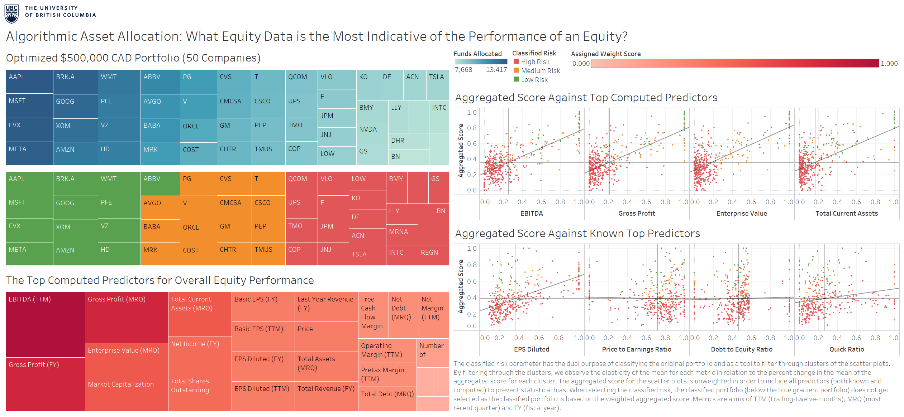
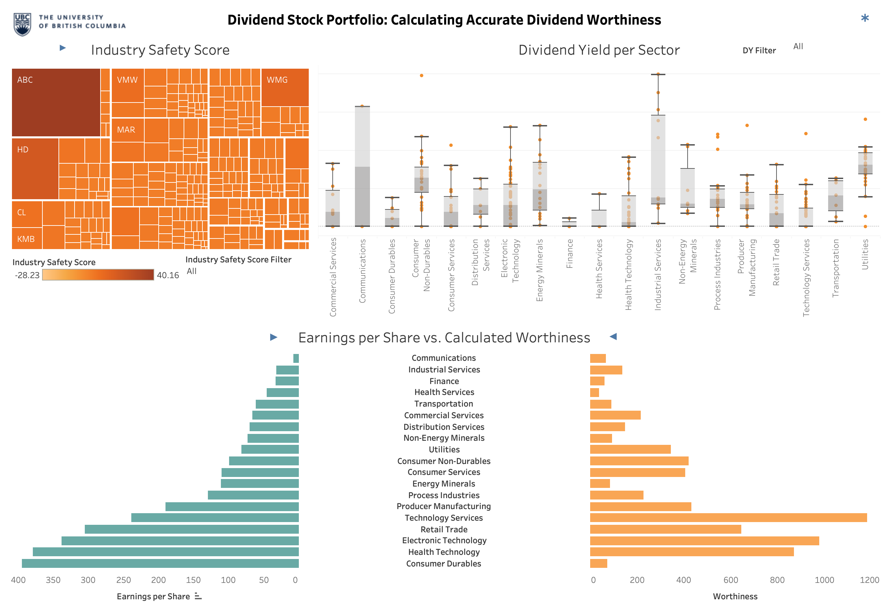
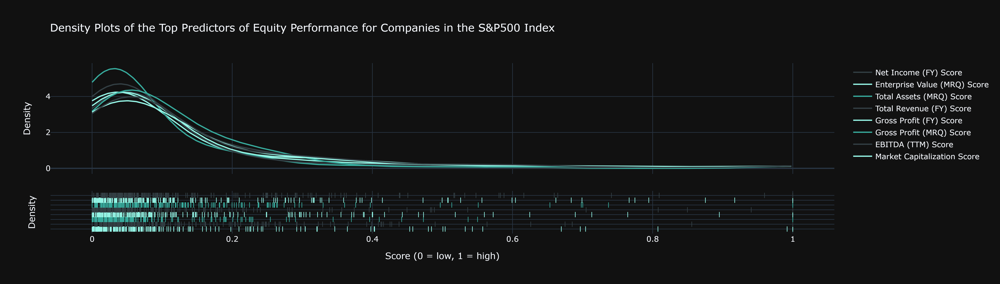

# Group 15 - Algorithmic Asset Allocation and Portfolio Construction

## Milestones

Details for Milestone are available on Canvas (left sidebar, Course Project).

## Describe your topic/interest in about 150-200 words

Our combined goal is to investigate what equity data is the most important to consider when developing a portfolio of equities that preferences either a growth portfolio or value investment strategy. From an industry perspective, we intend to provide a solution to the problem of maximizing client returns by optimizing risk and return in the case of optimal asset allocation. Clients have diverse investment goals, which is why we have divided our group project into the explortation of both growth and value investment strategies. As a successful analysis requires us to validate our findings with a series of control tests, we are equally passionate about discovering new trends in our data in addition to validating our findings with that is already known. Therefore, our research questions inherently prescribe an implicit comparison with known factors. We are passionate about revealing underlying trends across financial markets, being composed of a group of Computer Science and Data Science students.

## Describe your dataset in about 150-200 words

The raw data is composed of 7 data sets of equity data that includes data on the financial accounts, valuation, performance, dividends and margins of 8116 publicly-traded companies in the United States. The data is sourced from [TradingView](https://www.tradingview.com/), which grants the permission to use and distribute the data per their [attribution policy](https://www.tradingview.com/policies/) cited in their Terms of Service[^1]. This data has been extracted from TradingView's publicly available [Stock Screener](https://www.tradingview.com/screener/).

There are 76 data columns shared across all 7 data sets, of which 70 of them are unique. Select market data is provided by ICE Data Services, integrasted by TradingView. As the S&P 500 Index is the generally accepted benchmark for the top performing companies in the United States, 500 rows of data will be used, in which the number of columns will be significantly reduced according to their relevance in our analysis. Consequently, the total number of raw data points is 616816, of which our analysis will focus on 35000 unique raw data points. The data sets capture static financial market data for the **30th of January, 2023**, which can be updated by uploading new data, but for our analysis, will remain constant.

## Team Members

- Colin Lefter: I am a first-year Computer Science student who is passionate about algorithmic finanical modelling, having experience with algorithmic trading, Python, Java and R.
- Keisha Kwek: I am a first-year student in the Faculty of Science on track to major in Data Science. I am passionate about various environmental and economical sustainability matters in the world, where I hope to contribute in the improvement of with the application of my skills from my degree.

## Images

## References

[^1]: From TradingView's [Terms of Service](https://www.tradingview.com/policies/) page:

> TradingView grants all users of tradingview.com, and all other available versions of the site, to use snapshots of TradingView charts in analysis, press releases, books, articles, blog posts and other publications. In addition, TradingView grants the use of all previously mentioned materials in education sessions, the display of TradingView charts during video broadcasts, which includes overviews, news, analytics and otherwise use or promote TradingView charts or any products from the TradingView website on the condition that TradingView attribution is clearly visible at all times when such charts and products are used.

> **Attribution must include a reference to TradingView, including, but not limited to, those described herein.**