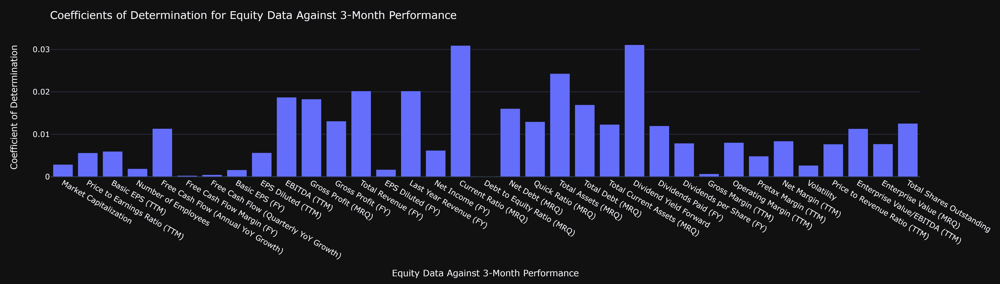
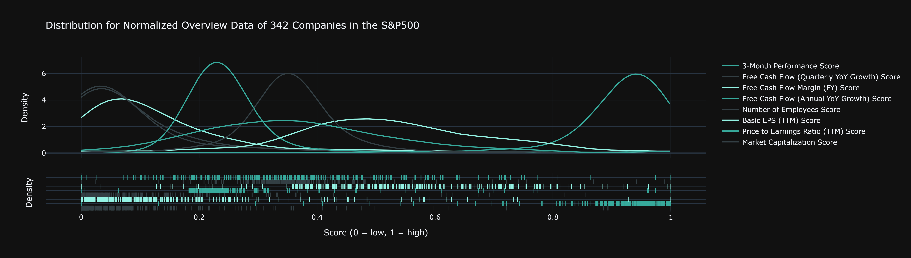
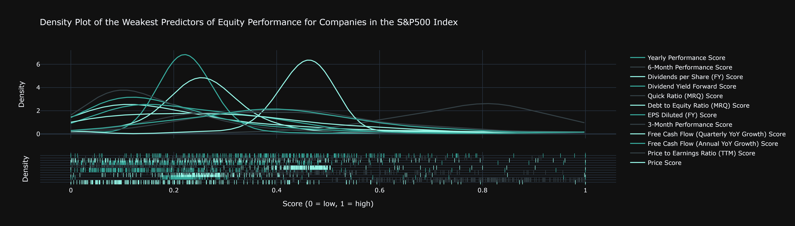
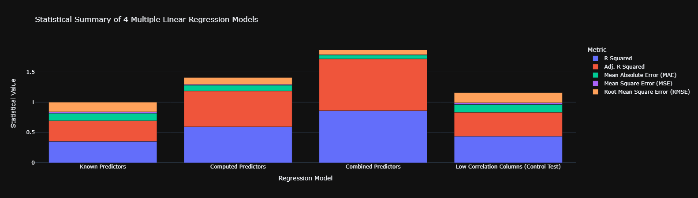

# Final Report

## Introduction

Our combined goal is to investigate what equity data is the most important to consider when developing a portfolio of equities that preferences either a growth portfolio or value investment strategy. From an industry perspective, we intend to provide a solution to the problem of maximizing client returns by optimizing risk and return in the case of optimal asset allocation. Clients have diverse investment goals, which is why we have divided our group project into the explortation of both growth and value investment strategies. Our data is composed of 7 data sets of equity data that includes data on the financial accounts, valuation, performance, dividends and margins of companies part of the S&P500 Index. We are passionate about revealing underlying trends across financial markets, being composed of a group of Computer Science and Data Science students.

## Exploratory Data Analysis

Due to the lack of time series data, our initial definition of equity performance related the values of each quarterly (MRQ) metric to the 3-month change in the price of the equity. With the 3-month change metric referring to the change in the price of each equity since the release of quarterly data, it made sense to use only quarterly data for our analysis. However, constructing several linear regression models yielded no correlation for any metric with the 3-month change in price.

This signaled that the definition of equity performance had to be adjusted to accurately account for the static-data limitation of our data set.

After constructing a density plot for every financial metric across all 7 data sets, we noticed that many distributions were significantly skewed, hinting that the value in our analysis may in fact be by defining equity performance as the degree at which a company scores highly across all financial metrics. This proposition lead to the hypothesis that perhaps the top performing companies are those which exist as outliers in distributions that are skewed towards the low score range[^1]. This same hypothesis lead us to use heat maps in our analysis to map the performance of companies across every metric.

[^1]: As the nature of our analysis requires us to compare metrics that have different value ranges, we devised a custom scoring algorithm that utilises a modified normalization algorithm that classifies outliers as especially important. See the `analysis1.ipynb` notebook for more details.

## Part 1: Algorithmic Asset Allocation | Growth Portfolio Investment Strategy

#### Colin Lefter

> What equity data is the most indicative of the performance of an equity, and of this data, which is the most relevant for a growth portfolio investment strategy such that we can compute an optimized portfolio of equities?

As per the series of analysis algorithms developed[^2], the top predictors for equity performance include **EBITDA (TTM)[^3], Gross Profit (MRQ), Enterprise Value (MRQ), Total Current Assets (MRQ), Net Income (FY), Total Shares Outstanding and Basic EPS (FY), among others.** When compared alongside the metrics that are generally considered as being the most important to consider when investing, namely, **EPS Diluted, the Price to Earnings Ratio, Debt to Equity Ratio and Quick Ratio,** the top computed metrics are significantly more successful in filtering through the excessive noise in the S&P500 equity data set.

[^2]: See `analysis1.ipynb` for more details.

[^3]: EBITDA refers to Earnings Before Interest, Tax, Depreciation and Amortization. TTM, MRQ and FY refer to trailing twelve months, most recent quarter and fiscal year.

**Figure 1**: Faceted Heat Map Grid of Normalized Equity Data from the Top (Left) and Bottom (Right) 20 Companies in the S&P500 Index by Predictor (1 = Best, 0 = Worst).

By comparing the top 20 and bottom 20 companies in the S&P500 Index through a faceted heat map plot, and sorting each heat map subplot by each predictor, there is a clear distinction between the overall equity performance of the top 20 and bottom 20 companies when using the top computed predictors. Each subplot features two heat maps (from the top 20 and bottom 20 companies, respectively) that have been merged together to show this contrast. Evidently, as we approach the 4th row of the faceted heat map plot, the degree of contrast becomes increasingly less apparent. This observation inspired the designation of weights to each computed top predictor to more accurately reflect the statistical significance of each metric when computing the aggregated scores for each equity in the data set[^2].

**Figure 2:** Density Plots of the Strongest and Weakest Predictors of Equity Performance for Companies in the S&P500 Index.

As we recall the initial hypothesis that the top performing equities may be those that are outliers in negatively-skewed distributions, isolating the best and worst computed predictors for further analysis does indeed support this hypothesis. The density plot for the top computed predictors shows a profoundly negatively-skewed distribution. As a control test, the density plot of the worst computed predictors does not produce the same results--the distributions are spread out across the normalized score range, suggesting that the worst computed metrics do not reliably filter through the noise in the S&P500 Index.

**Figure 3:** Cross-comparison of 4 Multiple Linear Regression Models.

Nevertheless, a cross-comparison of 4 multiple linear regression models reveals that **combining the top computed predictors with the top known predictors yields the most accurate prediction of overall equity performance[^2].** This model suggests that the top computed predictors are highly effective in filtering through the noise in the data set, and when paired together with the top known predictors, the return on investment for a portfolio of equities is optimized. 

---

## Conclusion

**Figure 4:** Tableau Dashboard: What Equity Data is the Most Indicative of the Performance of an Equity?

To address the final component of the research question, the optimized portfolio of equities can be seen in the Tableau dashboard created for the research question. The sample portfolio of equities has been created by accounting for the top computed predictors, in which it is evident that **EBITDA (TTM), Gross Profit (MRQ), Enterprise Value (MRQ) and Total Current Assets (MRQ)** are the four most important metrics for a growth portfolio investment strategy. These predictors are consistent with those generally recommended for growth stocks[^5]. Such a strategy results in the selection of many companies in the technology industry, such as Apple and Microsoft, which is consistent with the notion that growth stocks are those that generally outperform the S&P500 benchmark by yielding stronger returns[^6]. The combination of the top computed predictors with the top known predictors is likey best for a GARP investment strategy as many of the known predictors constitute those that are recommended for value investing[^7].

As an extension to the analysis conducted, utilising the same analysis algorithms on a time series data set for equity data will further validate these findings on a longer time scale. It is important to note that the data set used for this analysis is one that comprises equity data from a declining market, namely, a global recession. As a result, utilising time series data would validate these findings across multiple markets.

[^5]: Segal, Troy. “Growth Investing: Overview of the Investing Strategy.” Investopedia, Dotdash Meredith, 5 Jan. 2023, https://www.investopedia.com/terms/g/growthinvesting.asp. 

[^6]: Hayes, Adam. “Growth Stock: What It Is, Examples, Growth Stock vs. Value Stock.” Investopedia, Dotdash Meredith, 3 Oct. 2022, https://www.investopedia.com/terms/g/growthstock.asp. 

[^7]: Elmerraji, Jonas. “5 Must-Have Metrics for Value Investors.” Investopedia, Dotdash Meredith, 5 Apr. 2023, https://www.investopedia.com/articles/fundamental-analysis/09/five-must-have-metrics-value-investors.asp.

## Part 2: Title

#### Keisha Kwek

Content.

## Conclusion

---
Content.