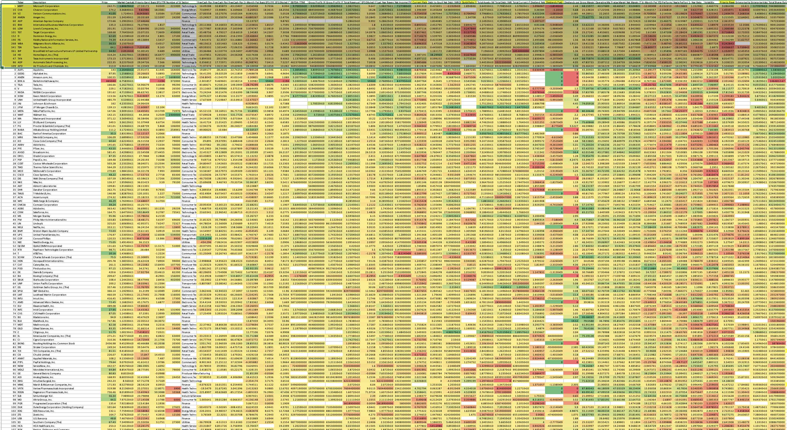
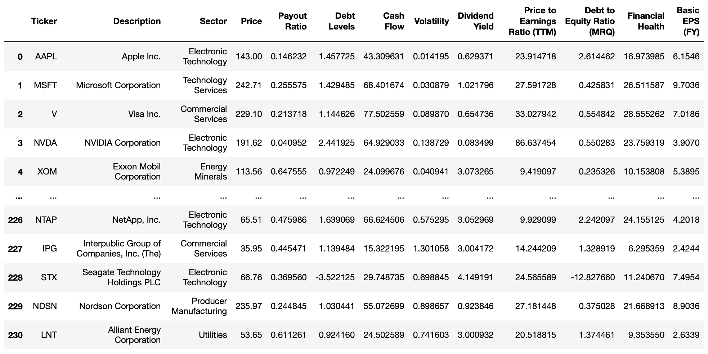
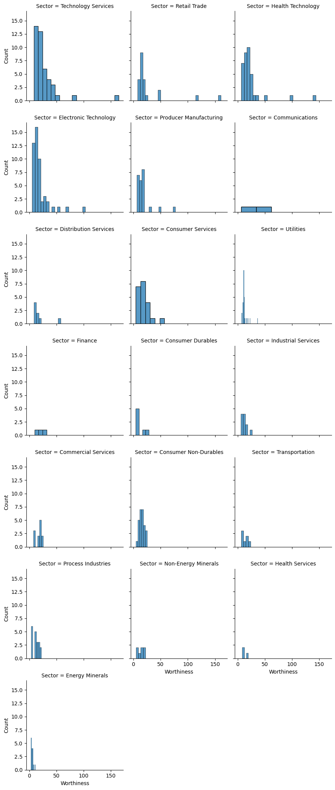
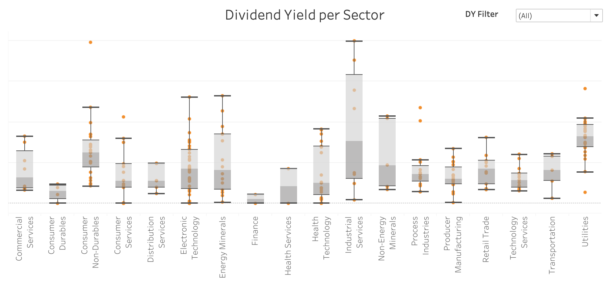
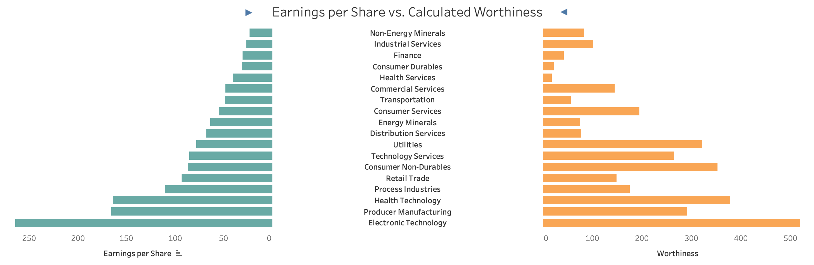
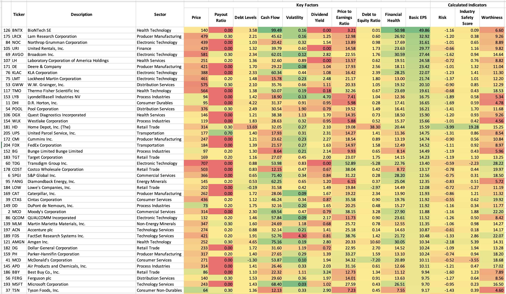
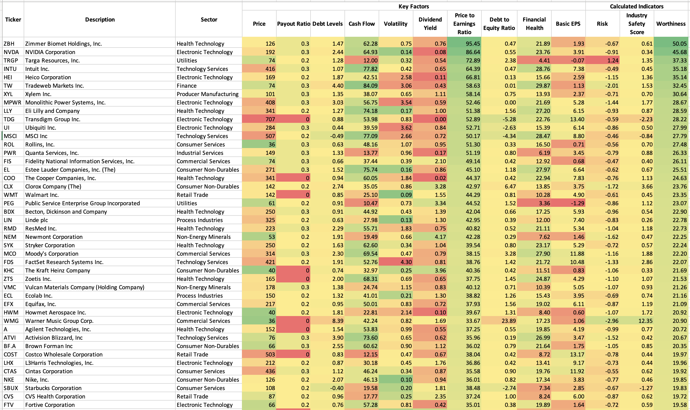
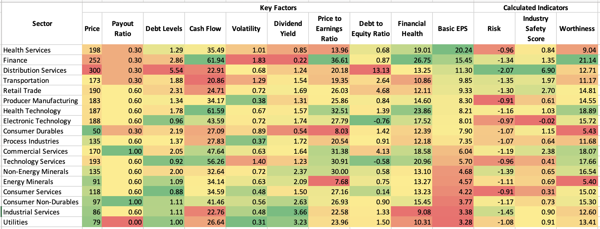
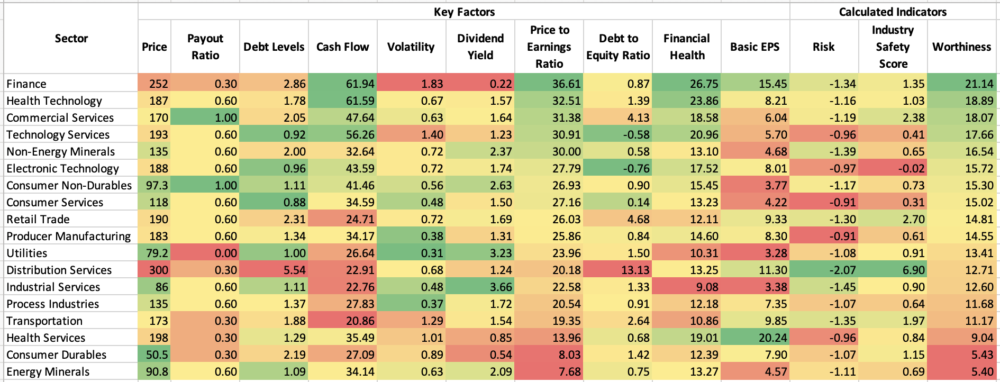
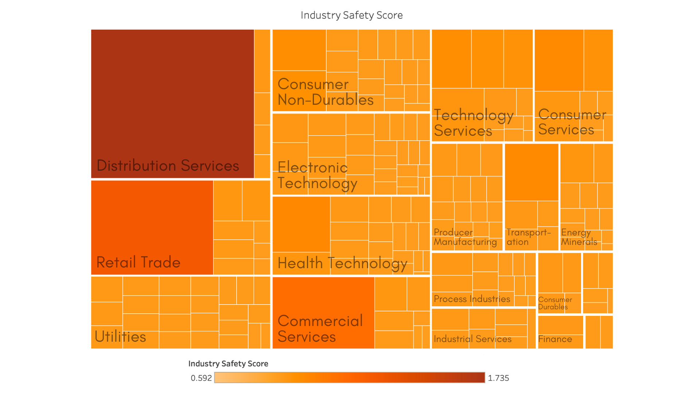

# Dividend Stock Portfolio
## What makes a dividend stock of value companies worthy to invest in?

## **Introduction**

Stocks have a reputation of being inherently unpredictable as it involves multiple levels of prediction of a stock's future price to yield significant profit by only using available information.

Amongst the available information, most investors look at the Earnings per Share (EPS, Basic and Diluted) to gauge the future prices of a particular stock.

However, the calculation of a **value** **stock's** future price (or commonly referred to as worthiness of investing in this analysis) involves more variables that account for the long-term growth and health of a company and industry. This shows that merely calculating through EPS values would not account for a company's performance in industry's fluctuations, especially differing economic situations.

Hence, this analysis hopes to break down the variables that represents a company's strength in varying economic conditions based on our current data, alongisde the strength of the industry itself.

## **Research Question**
What are the best metrics to use to rank the value of a value stock for a dividend stock portfolio calculation and how can it be best enumerated to yield the most accurate results?

## **Analysis Plan**

## **Analysis & Discussion**

## I. Determining a good dividend stock

Before determining the key variables to quantify dividend stocks, we must first try to understand what dividend stocks professions are recommending. Upon research, it is seen that U.S. News & World Report, Investopedia, and the Motley Fool recommended the following 10-15 dividends to invest in:
1. Microsoft Corporation
1. Chevron Corporation
1. Verizon Communications Inc.
1. Amgen Inc.
1. American Express Company
1. International Business Machines Corporation
1. Lowe's Companies, Inc.
1. Target Corporation
1. Dominion Energy, Inc.
1. Fidelity National Information Services, Inc.
1. Walgreens Boots Alliance, Inc.
1. Tyson Foods, Inc.
1. Brookfield Infrastructure Partners LP Limited Partnership
1. Home Depot, Inc. (The)
1. Texas Instruments Incorporated
1. Automatic Data Processing, Inc.
1. Air Products and Chemicals, Inc.

Amongst these stocks, a heatmap is created to identify the characteristics that differentiate them from the other stocks. 

*Picture 1.1: Heatmap of all stocks and its stock attributes (company performance, balance sheet, etc.)*

In this heatmap, the table is sorted based on the recommended dividend stocks, which is highlighted in yellow. It can be seen that while most variables remained "normal" the Current Ratio, Quick Ratio, and Dividends Paid of the recommended stocks is seen to be the most nontypical in comparison to its stock counterparts. 

However, it is not enough to only take these three variables and use them as metrics to calculate the best dividend stocks. This is because there are a large amount of stocks which have similar values as they do, but the difference is the other stocks may have a good current ratio but a bad quick ratio, or a good quick ratio but an insufficient amount of dividends paid. For this reason, the values behind current ratio, quick ratio, and dividends paid will be broken down into separate variables that can be precisely measured and sorted for further compatisons. 

 **Variables that portrude differing weights in comparison to the other stocks and their meaning:**

1. **Current ratio**: a company's ability to pay short-term liabilities (debt and obligations) with its current assets (cash, inventory, and receivables).
1. **Quick ratio**: often referred to the acid-test ratio, it measures the liquidity of a company by gauging its current assets' abilities to cover its current liabilities.
1. **Dividends paid**: this is the amount of dividends the company pays out to the shareholders of the dividend stock.

These variables show that these variables are highly correlated with a company's debts, assets, cash flow, liquidity, and dividend payments. Through these, we can move forward in selecting the essential the  variables from the equities trading data in the following stages: 

### Stage 1.1: Defining a good dividend stock
After research of reliable trading websites such as U.S. News & World Report, Investopedia, and the Motley Fool, around 10-15 dividend stocks were selected as "the top dividend stocks to consider buying". By laying the basics of what best describes a good dividend stock presented by their variables in the trading data, the analysis and aggregation will be usable to different and updated stock lists. Upon further research and analysis, the following variables present to be the variables commonly seen in these strongly endorsed dividend stocks, as correlated with the three variables previously mentioned:

1. Consistent Dividend Payments: a good track record of dividend payments over time indicates that the company has a stable financial position shown from generating sufficient cash flow which is an important variable to support dividend payments.
2. Strong Financials: A strong balance sheet, healthy cash flow, and sustainable earnings growth ensures that the company can continue to pay dividends through tough economic times.
3. Low payout Ratio (percentage of earnings paid out as dividends): a high payout ratio means the company is not reinvesting enough capital to support future growth, which may be a red flag for long-term investment.
4. Competitive Dividend Yield: This is compared to other companies in the same industry of the broader market. It is important to note that although a high yield is attractive, it may not be sustainable for the company itself.

### Stage 1.2: Calculating the risk score (based on the company’s industry position) 

As dividend stocks are typically run long-term, the risk factors would involve the history of a company's performance. Hence the following key variables to determine risk factors are measured:

#### **Key risk factors**:
##### Quantifying the variables into a score of 0-100% using a weighted average:

1. **Payout Ratio (10%)**: when a company has a higher percentage of its earnings as dividends this may present as a higher risk as it means they are not investing enough in the company. As this is risky for the long-term and critical for dividend sustainability, it receives a score of 10%.
1. **Debt levels (25%)**: companies with higher debt may struggle to continue paying dividends and are in more of a risk to declare bankruptcy. As this is an element that significantly impacts a company's health and company health is a major aspect seen from the derivations above, it will receive a score of 25%.
1. **Industry volatility (30%)**: cyclical industries are at risk of volatile earnings and cash flows, hence not generating enough funds to paying dividends. Especially in times of economic uncertainty, some companies will perserve cash over paying dividends - resulting in a cut of dividends. This is why this variable is 30% as it is a variable strongly related to dividend payments.
1. **Dividend history (35%)**: providing insight into a company's commitment to maintaining or increasing dividends over time, it allows a metric to account for amount of dividends paid - a crucial variable that is seen in the top recommended value stocks mentioned above.

### Stage 2.2: Calculating the Industry Safety Score

The Industry Safety Score is a metric made to account for the safety of an industry by viewing its industry stability and financial health of companies in a particular industry.

1. **Industry stability (50%)**: Calculated using the inverse of the volatile variable in the balance sheet, stable industries have steady demand for their products or services, hence they are less susceptible to economic downturns or competition from new entrants. Long history of stable growth and profitability shows a stable industry, shows better likelihood that the company will not fall behind in dividend payments.
1. **Financial health of companies within an industry (50%)**: As mentioned above, the financial health of a company is a large variable to account in a company's ability to fulfil their dividend payments in full. These financial health variables rely on cash flows, debt-to-equity ratio, earnings growth, and history of dividend payments. It also accounts for the possibility of the company having the foundation for future dividend increases.

### Stage 3: Calculating the Worthiness of a Value Stock

The worthiness of investing in a value stock will take account the previously calculated variables alongside other variables which effect a company's current ratio, quick ratio, and dividends paid - variables which were found to be most commonly different of endorsed value stocks from the rest of the value stocks.

### Fixed Variables (60%)

1. Financial Health (20%):
2. Price to Earnings Ratio (20%):
3. Industry Safety Score (20%):

### Client-driven Variables (40%)

1. Dividend yield (20%):
1. Risk(20%):

1. **Dividend yield (30%)**: dividend yield is the annual dividend payment as a percentage of stock price. As a higher dividend yield provides a significant stream of income for the investor, it is typically the primary reason for investing in dividend stocks. 
1. Dividend growth (25%): rate at which the company increases its dividend payment over time. Companies that increase their dividend payments consistently are considered financially stable and successful. Good for maximising total return on investment, provides both income and capital appreciation. 
1. Company’s financial health (20%): (debt levels, cash flows, profitability) impacts a company’s ability to maintain and grow its dividend payments over time (sustainability).
1. Valuation (15%): price relative to its earnings, cash flow, or other financial metrics. – an overvalued stock is not worth the investment (even if its a high dividend yield). 
1. Industry outlook (10%): (expected growth and profitability of the industry)  – Industry safety score

- fix lbelling

div yield is considered uncounted as it is a variable the user selects

## **Final Output**

## **Conclusion & Remarks**

1. Things we are not measuring here:
1. Regulatory environment (can impact the safety of an industry – regulatory risks of an industry like changes in tax laws, tariffs, or environmental regulations) can impact them a lot. But we will not be measuring it here.
1. Economic conditions: economic outlook such as inflation or interest rates may cause potential risks.