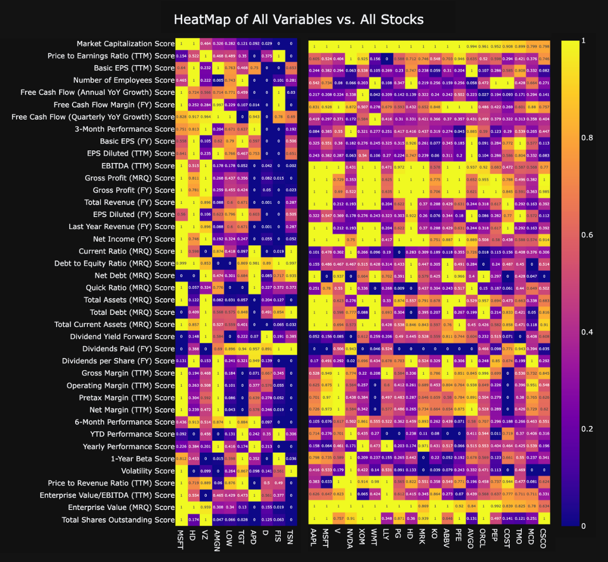
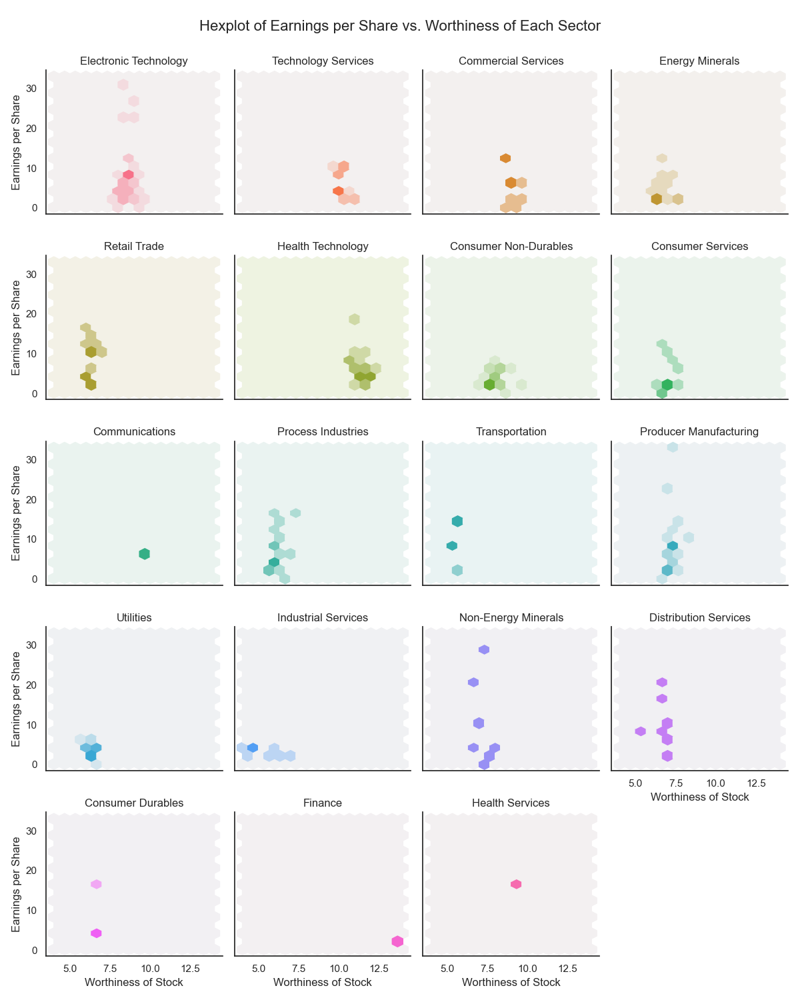

# Final Report

## Introduction

Our combined goal is to investigate what equity data is the most important to consider when developing a portfolio of equities that preferences either a growth portfolio or value investment strategy. From an industry perspective, we intend to provide a solution to the problem of maximizing client returns by optimizing risk and return in the case of optimal asset allocation. Clients have diverse investment goals, which is why we have divided our group project into the explortation of both growth and value investment strategies. Our data is composed of 7 data sets of equity data that includes data on the financial accounts, valuation, performance, dividends and margins of companies part of the S&P500 Index. We are passionate about revealing underlying trends across financial markets, being composed of a group of Computer Science and Data Science students.

## Exploratory Data Analysis

Due to the lack of time series data, our initial definition of equity performance related the values of each quarterly (MRQ) metric to the 3-month change in the price of the equity. With the 3-month change metric referring to the change in the price of each equity since the release of quarterly data, it made sense to use only quarterly data for our analysis. However, constructing several linear regression models yielded no correlation for any metric with the 3-month change in price.

This signaled that the definition of equity performance had to be adjusted to accurately account for the static-data limitation of our data set.

After constructing a density plot for every financial metric across all 7 data sets, we noticed that many distributions were significantly skewed, hinting that the value in our analysis may in fact be by defining equity performance as the degree at which a company scores highly across all financial metrics. This proposition lead to the hypothesis that perhaps the top performing companies are those which exist as outliers in distributions that are skewed towards the low score range[^1]. This same hypothesis lead us to use heat maps in our analysis to map the performance of companies across every metric.

[^1]: As the nature of our analysis requires us to compare metrics that have different value ranges, we devised a custom scoring algorithm that utilises a modified normalization algorithm that classifies outliers as especially important. See the `analysis1.ipynb` notebook for more details.

## Part 1: Algorithmic Asset Allocation | Growth Portfolio Investment Strategy

#### Colin Lefter

> What equity data is the most indicative of the performance of an equity, and of this data, which is the most relevant for a growth portfolio investment strategy such that we can compute an optimized portfolio of equities?

As per the series of analysis algorithms developed[^2], the top predictors for equity performance include **EBITDA (TTM)[^3], Gross Profit (MRQ), Enterprise Value (MRQ), Total Current Assets (MRQ), Net Income (FY), Total Shares Outstanding and Basic EPS (FY), among others.** When compared alongside the metrics that are generally considered as being the most important to consider when investing, namely, **EPS Diluted, the Price to Earnings Ratio, Debt to Equity Ratio and Quick Ratio,** the top computed metrics are significantly more successful in filtering through the excessive noise in the S&P500 equity data set.

[^2]: See `analysis1.ipynb` for more details.

[^3]: EBITDA refers to Earnings Before Interest, Tax, Depreciation and Amortization. TTM, MRQ and FY refer to trailing twelve months, most recent quarter and fiscal year.

**Figure 1**: Faceted Heat Map Grid of Normalized Equity Data from the Top (Left) and Bottom (Right) 20 Companies in the S&P500 Index by Predictor (1 = Best, 0 = Worst).

By comparing the top 20 and bottom 20 companies in the S&P500 Index through a faceted heat map plot, and sorting each heat map subplot by each predictor, there is a clear distinction between the overall equity performance of the top 20 and bottom 20 companies when using the top computed predictors. Each subplot features two heat maps (from the top 20 and bottom 20 companies, respectively) that have been merged together to show this contrast. Evidently, as we approach the 4th row of the faceted heat map plot, the degree of contrast becomes increasingly less apparent. This observation inspired the designation of weights to each computed top predictor to more accurately reflect the statistical significance of each metric when computing the aggregated scores for each equity in the data set[^2].

**Figure 2:** Density Plots of the Strongest and Weakest Predictors of Equity Performance for Companies in the S&P500 Index.

As we recall the initial hypothesis that the top performing equities may be those that are outliers in negatively-skewed distributions, isolating the best and worst computed predictors for further analysis does indeed support this hypothesis. The density plot for the top computed predictors shows a profoundly negatively-skewed distribution. As a control test, the density plot of the worst computed predictors does not produce the same results--the distributions are spread out across the normalized score range, suggesting that the worst computed metrics do not reliably filter through the noise in the S&P500 Index.

**Figure 3:** Cross-comparison of 4 Multiple Linear Regression Models.

Nevertheless, a cross-comparison of 4 multiple linear regression models reveals that **combining the top computed predictors with the top known predictors yields the most accurate prediction of overall equity performance[^2].** This model suggests that the top computed predictors are highly effective in filtering through the noise in the data set, and when paired together with the top known predictors, the return on investment for a portfolio of equities is optimized. 

---

## Conclusion

**Figure 4:** Tableau Dashboard: What Equity Data is the Most Indicative of the Performance of an Equity?

To address the final component of the research question, the optimized portfolio of equities can be seen in the Tableau dashboard created for the research question. The sample portfolio of equities has been created by accounting for the top computed predictors, in which it is evident that **EBITDA (TTM), Gross Profit (MRQ), Enterprise Value (MRQ) and Total Current Assets (MRQ)** are the four most important metrics for a growth portfolio investment strategy. These predictors are consistent with those generally recommended for growth stocks[^5]. Such a strategy results in the selection of many companies in the technology industry, such as Apple and Microsoft, which is consistent with the notion that growth stocks are those that generally outperform the S&P500 benchmark by yielding stronger returns[^6]. The combination of the top computed predictors with the top known predictors is likey best for a GARP investment strategy as many of the known predictors constitute those that are recommended for value investing[^7].

As an extension to the analysis conducted, utilising the same analysis algorithms on a time series data set for equity data will further validate these findings on a longer time scale. It is important to note that the data set used for this analysis is one that comprises equity data from a declining market, namely, a global recession. As a result, utilising time series data would validate these findings across multiple markets.

[^5]: Segal, Troy. “Growth Investing: Overview of the Investing Strategy.” Investopedia, Dotdash Meredith, 5 Jan. 2023, https://www.investopedia.com/terms/g/growthinvesting.asp. 

[^6]: Hayes, Adam. “Growth Stock: What It Is, Examples, Growth Stock vs. Value Stock.” Investopedia, Dotdash Meredith, 3 Oct. 2022, https://www.investopedia.com/terms/g/growthstock.asp. 

[^7]: Elmerraji, Jonas. “5 Must-Have Metrics for Value Investors.” Investopedia, Dotdash Meredith, 5 Apr. 2023, https://www.investopedia.com/articles/fundamental-analysis/09/five-must-have-metrics-value-investors.asp.

 

## Part 2: Dividend Stock Investing

#### Keisha Kwek
 

## What makes a dividend stock of value companies worthy to invest in?

## **Introduction**

Stocks have a reputation of being inherently unpredictable as it involves multiple levels of prediction of a stock's future price to yield significant profit by only using available information.

Amongst the available information, most investors look at the Earnings per Share (EPS, Basic and Diluted) to gauge the future prices of a particular stock.

However, the calculation of a **value** **stock's** future price (or commonly referred to as worthiness of investing in this analysis) involves more variables that account for the long-term growth and health of a company and industry. This shows that merely calculating through EPS values would not account for a company's performance in industry's fluctuations, especially differing economic situations.

Hence, this analysis hopes to break down the variables that represents a company's strength in varying economic conditions based on our current data, alongisde the strength of the industry itself.

## **Research Question**
What are the best metrics to use to rank the value of a value stock for a dividend stock portfolio calculation and how can it be best enumerated to yield the most accurate results?

## **Analysis & Discussion**

## I. Determining a good dividend stock

Before determining the key variables to quantify dividend stocks, we must first try to understand what dividend stocks professions are recommending. Upon research, it is seen that U.S. News & World Report[^8], Investopedia[^9], and the Motley Fool[^10] recommended the following 10-15 dividends to invest in:
1. Microsoft Corporation
1. Chevron Corporation
1. Verizon Communications Inc.
1. Amgen Inc.
1. American Express Company
1. International Business Machines Corporation
1. Lowe's Companies, Inc.
1. Target Corporation
1. Dominion Energy, Inc.
1. Fidelity National Information Services, Inc.
1. Walgreens Boots Alliance, Inc.
1. Tyson Foods, Inc.
1. Brookfield Infrastructure Partners LP Limited Partnership
1. Home Depot, Inc. (The)
1. Texas Instruments Incorporated
1. Automatic Data Processing, Inc.
1. Air Products and Chemicals, Inc.

Amongst these stocks, a heatmap is created to identify the characteristics that differentiate them from the other stocks. 

 

 Picture 1.1: Heatmap of all stocks and its stock attributes in Plotly

 

Here, the left heatmap is the plotting between the top 17 companies and the right heatmap is the plotting between the rest of the companies to be in comparison.

Another version of this heatmap was also made in Microsoft Excel to specifically highlight the top recommended companies. 

 

 Picture 1.2: Heatmap of all stocks and its stock attributes in Microsoft Excel

 

In this heatmap, the table is sorted based on the recommended dividend stocks, which is highlighted in yellow. It can be seen that while most variables remained "normal" the Current Ratio, Quick Ratio, and Dividends Paid of the recommended stocks is seen to be the most nontypical in comparison to its stock counterparts. 

However, it is not enough to only take these three variables and use them as metrics to calculate the best dividend stocks. This is because there are a large amount of stocks which have similar values as they do, but the difference is the other stocks may have a good current ratio but a bad quick ratio, or a good quick ratio but an insufficient amount of dividends paid. For this reason, the values behind current ratio, quick ratio, and dividends paid will be broken down into separate variables that can be precisely measured and sorted for further compatisons. 

 **Variables that portrude differing weights in comparison to the other stocks and their meaning:**

1. **Current ratio**: a company's ability to pay short-term liabilities (debt and obligations) with its current assets (cash, inventory, and receivables).
1. **Quick ratio**: often referred to the acid-test ratio, it measures the liquidity of a company by gauging its current assets' abilities to cover its current liabilities.
1. **Dividends paid**: this is the amount of dividends the company pays out to the shareholders of the dividend stock.

These variables show that these variables are highly correlated with a company's debts, assets, cash flow, liquidity, and dividend payments. Through these, we can move forward in selecting the essential the  variables from the equities trading data in the following stages: 

 

### Stage 1.1: Defining a good dividend stock

After research of reliable trading websites such as U.S. News & World Report, Investopedia, and the Motley Fool, around 10-15 dividend stocks were selected as "the top dividend stocks to consider buying". By laying the basics of what best describes a good dividend stock presented by their variables in the trading data, the analysis and aggregation will be usable to different and updated stock lists. Upon further research and analysis, the following variables present to be the variables commonly seen in these strongly endorsed dividend stocks, as correlated with the three variables previously mentioned:

1. Consistent Dividend Payments: a good track record of dividend payments over time indicates that the company has a stable financial position shown from generating sufficient cash flow which is an important variable to support dividend payments.
2. Strong Financials: A strong balance sheet, healthy cash flow, and sustainable earnings growth ensures that the company can continue to pay dividends through tough economic times.
3. Low payout Ratio (percentage of earnings paid out as dividends): a high payout ratio means the company is not reinvesting enough capital to support future growth, which may be a red flag for long-term investment.
4. Competitive Dividend Yield: This is compared to other companies in the same industry of the broader market. It is important to note that although a high yield is attractive, it may not be sustainable for the company itself.

 

### Stage 1.2: Calculating the risk score (based on the company’s industry position) 

As dividend stocks are typically run long-term, the risk factors would involve the history of a company's performance[^11]. Hence the following key variables to determine risk factors are measured:

#### **Key risk factors**:
##### Quantifying the variables into a score of 0-100% using a weighted average:

1. **Payout Ratio (25%)**: when a company has a higher percentage of its earnings as dividends this may present as a higher risk as it means they are not investing enough in the company. This variable takes into account the dividend consistency of a company in its calculation, as it is *dividends per share divided by basic EPS*. As this is risky for the long-term and critical for dividend sustainability, it receives a score of 10%.
1. **Debt levels (25%)**: companies with higher debt may struggle to continue paying dividends and are in more of a risk to declare bankruptcy. As this is an element that significantly impacts a company's health and company health is a major aspect seen from the derivations above, it will receive a score of 25%.
1. **Value stock volatility (50%)**: This is the number which shows the fluctuations of each value stock in the stock market.

 

### Stage 2.2: Calculating the Industry Safety Score

The Industry Safety Score is a metric made to account for the safety of an industry by viewing its industry stability and financial health of companies in a particular industry.

1. **Industry stability (50%)**: Calculated using the reciprocal of the volatile variable in the balance sheet, stable industries have steady demand for their products or services, hence they are less susceptible to economic downturns or competition from new entrants. Long history of stable growth and profitability shows a stable industry, shows better likelihood that the company will not fall behind in dividend payments.
1. **Financial health of companies within an industry (50%)**: As mentioned above, the financial health of a company is a large variable to account in a company's ability to fulfil their dividend payments in full. These financial health variables rely on cash flows, debt-to-equity ratio, earnings growth, and history of dividend payments. It also accounts for the possibility of the company having the foundation for future dividend increases.

 

### Stage 3: Calculating the Worthiness of a Value Stock

The worthiness of investing in a value stock will take account the previously calculated variables alongside other variables which effect a company's current ratio, quick ratio, and dividends paid - variables which were found to be most commonly different of endorsed value stocks from the rest of the value stocks.

### Fixed Variables (60%)

1. **Financial Health (20%)**: As financial health impacts a company's sustainability to maintain and grow its dividend payments over time, it is a crucial aspect to include when calculating a value stock's worthiness in investing. 
2. **Price to Earnings Ratio (20%)**: A higher P/E ratio is a good metric for value stock success as it shows that investors are willing to pay a higher share price today because of growth expectations in the future. As investor demand influences the value stock prices, this is a crucial variable to be included. 
3. **Industry Safety Score (20%)**: Cyclical industries are at risk of volatile earnings and cash flows, hence not generating enough funds to paying dividends. Especially in times of economic uncertainty, some companies will perserve cash over paying dividends - resulting in a cut of dividends. This is why this variable is 30% as it is a variable strongly related to dividend payments.

### Client-driven Variables (40%)

These are the variables which will vary depending on the client input. It can be represented by the following three levels, however it will not be explored in this analysis; this is only to give an idea of the model:

1. Moderate risk, moderate yield
1. High risk, high outcome yield
1. Low risk, low outcome yield

Where the following variables will vary in client input to effect worthiness of investing in a value stock from 1-20% but both should add up to 40% of the worthiness calculation.

1. **Dividend yield (20%)**: Dividend yield is the annual dividend payment as a percentage of stock price. A higher dividend yield will provide a higher stream of income for the investor. If the client prefers a higher yield, they will increase the percentage of dividend yield accordingly to calcualte the worthiness of a value stock.
1. **Risk(20%)**: Risk will account for the client's ability to bear for risks. The higher the risk, the more the worthiness score will account for high-risk value stocks.  

 

## II. Analysis of Variables
After defining the given variables, data cleaning, and data aggregation, the following final DataFrame is outputted:

Picture 2.1: DataFrame of all calculated variables

 

From this DataFrame, we created a RidgeLine plot to visualize the average worthiness of each industry. 

Picture 2.2: Ridgeline Plot of Value Stock Worthiness

 

From this plot, we can see that the industry with the highest value stock worthiness is Health Technology and Technology Services, alongside that, there is a lack of variability and data points in the Finance and Health Services.

To better visualize this distribution, the following plot shows the worthiness of value stocks per industry using a boxplot, showing the individual plots to better understand how each distribution came to be. 

Picture 2.3: BoxPlot of Value Stock Worthiness

 

From this distribution, we can see that there are outliers most prominently seen in the following industries:

1. Technology Services
1. Consumer Non-Durables
1. Process Industries
1. Producer Manufacturing
1. Distribution Services

This may be because the nature of these industries are monopolies of oligopolies, meaning that only a few large firms make most of the sales in a particular industry. Through this plot, we are able to see which industries are of this type, and hence increase the chances of bigger returns - as investing in the big players will have less risk as they bring a more stable cash flow.

 

> This raises the question: How accurate are these calculations?

This pattern best seen in the Hexplot, where we are able to compare both the Worthiness of the Stocks in each sector plotted against the companies' Earnings per Share (EPS). As EPS is a common metric investors use to calculate the return of a stock where a higher EPS indicates greater value.

Picture 2.4: Hexplot of EPS vs. Worthiness of Value Stocks

 

From this plot, we can see how the variability of stock amount in each industry may impact the average score, and hence the data shown in the previous plots. Nonetheless, it can be seen how some companies have a large variation in the intensity between its Value Stock Worthiness as compared to its companies' EPS value. This may show how some industries' Value Stock Worthiness may be in correspondence with its companies' EPS value, meaning that some industries are influenced by volatility and economic fluctuations more than others.

As the EPS values do not incorporate industry volatility in its calculations, it shows that the more the Stock Worthiness diverges from the EPS value, the more it is influenced by economic of industrial fluctuations. In this case, the following industries are more volatile to economic change than other industries:

1. Non-Energy Minerals
2. Distribution Services
3. Retail Trade
4. Industrial Services

An evidence to this volatility is the fact that the pandemic is a recent economic change that influenced the stock market. It was seen that the pandemic caused a major halt in industries of Industrial Services and Retail Trade due to pandemic regulations[^12]. In contrast, we also know that due to current political shifts towards cheaper energy is adopted, and hence why there is a large degree of impact in Producer Manufacturing as compared to, say, Industrial Services[^13].

 

> How does the data present when compared to the three initial prominent variables?

The three initial prominent variables were seen to be Current Ratio, Quick Ratio, and Dividend Yield. In creating the worthiness score, we made sure to break down each of these variables into the components that it was created by so that we can truly analyze and classify the true raw variables that indicate the worthiness of a value stock. The relationship and correlation between the variables can be seen in the following plots.

Picture 2.5: Scatterplot of Quick Ratio and Value Stock Worthiness

 

It is seen here that there is a positive correlation, albeit weak, between the worthiness of the value stocks and the companies' quick ratio.

Picture 2.6: Scatterplot of Current Ratio and Value Stock Worthiness

 

Here, we can see that there is stronger positive correlation between the worthiness of the value stocks and the companies' quick ratio than the previous plot, however still being a weak correlation.

Picture 2.7: Scatterplot of Dividend Yield and Value Stock Worthiness

 

In this plot, it shows a very small correlation between the two variables, however there are separated patterns of strong correlation. This may be because the data used for these plots are a combination of all value stock worthiness.

Nonetheless, the following plot shows a better presentation of these values can be seen when each plot is labelled by the industries they are in.

Picture 2.8: FacetPlot of Current Ratio, Quick Ratio, Dividend Yield and Value Stock Worthiness

 

From this plot, we can see how the stocks of each sector are confined in their own specified area. For instance, the Worthiness column shows how the variation is seen between industries. When we take a closer look, we can find that each companies' value stock worthiness in a particular indudstry has a positive correlation with Dividend Yield. This pattern is also seen in the current and quick ratios, meaning that we have compartmentalized and broken down the components which make the three initial variables and applied them to our calculation of value stock worthiness accurately.

## **Conclusion & Remarks**

In conclusion, we were able to create a quite precise model in which accomodates the variables that create a worthy value stock to invest in. This process was authenticated by plotting the initial variables that started our variable aggregation analysis, alongside seeing its relationship in each industry. Even so, there are a few variables that we were not able to quantify and include in our analysis. For example, the regulatory risks of an industry (e.g. tax laws, tariffs, or environmental regulations) which can influence the value of stocks to a large extent was not calculated as there were no values that we could enumerate to represent them. That, on top of the fact that the nature of stocks are in general very unpredictable shows that there is also inaccuracy to this analysis to some extent. 

Overall, this analysis has shown that even the most unpredictable datasets that show large deviations can be analyzed when categorized and distinguished appropriately. 

[^8]: 15 Best Dividend Stocks to Buy Now | Investing | U.S. News. https://money.usnews.com/investing/dividends/slideshows/best-dividend-stocks-to-buy-this-year. 

[^9]: Reiff, Nathan. “Top Dividend Stocks for April 2023.” Investopedia, Investopedia, 29 Mar. 2023, https://www.investopedia.com/top-dividend-stocks-april-2023-7372726. 

[^10]: Hall, Jason. “Best Dividend Stocks to Buy and Hold in 2023.” The Motley Fool, https://www.fool.com/investing/stock-market/types-of-stocks/dividend-stocks/. 

[^11]: “Why Dividends Matter.” Fidelity, https://www.fidelity.com/learning-center/investment-products/stocks/why-dividends-matter. 

[^12]: Yec. “Council Post: The Aftermath and Impact of Covid-19 on Stock Markets.” Forbes, Forbes Magazine, 13 Feb. 2023, https://www.forbes.com/sites/theyec/2023/02/10/the-aftermath-and-impact-of-covid-19-on-stock-markets/?sh=4f0a88f2c120. 

[^13]: Bradley, Chris, and Peter Stumpner. “The Impact of Covid-19 on Capital Markets, One Year In.” McKinsey &amp; Company, McKinsey &amp; Company, 10 Mar. 2021, https://www.mckinsey.com/capabilities/strategy-and-corporate-finance/our-insights/the-impact-of-covid-19-on-capital-markets-one-year-in. 
